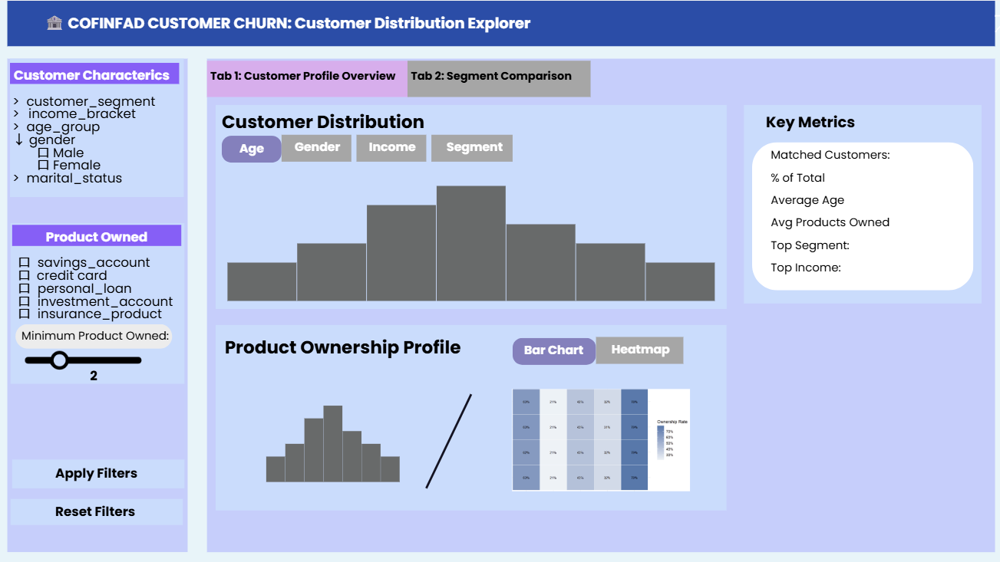
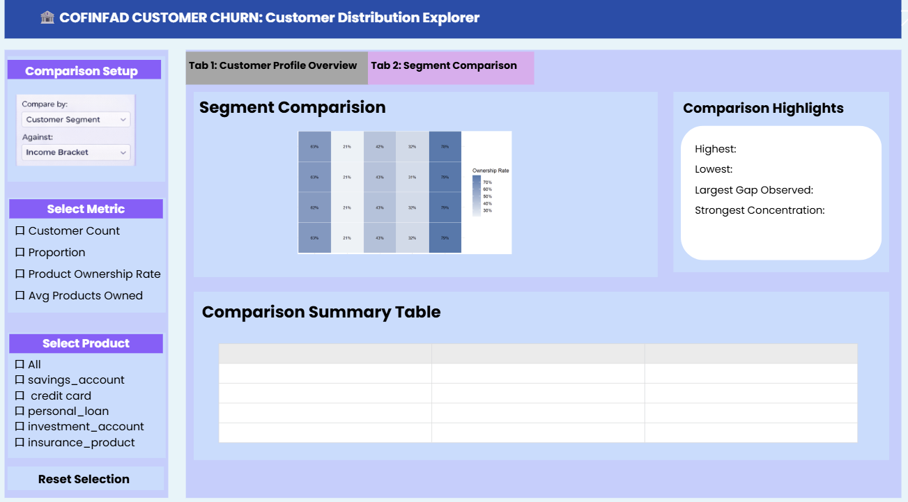

# Overview

This is Take-home Exercise 2 based on 2 complementary datasets from the COFINFAD (Colombian Fintech Financial Analytics Dataset) context: a customer-level dataset containing demographic, product adoption, engagement, and satisfaction-related attributes, and a transaction-level dataset capturing detailed customer financial activities. Together, these datasets provide both a high-level view of customer characteristics and a more granular view of transaction behavior, making them well suited for interactive visual analysis.

The proposed Shiny prototype focuses on Exploratory Data Analysis (EDA) and Comparative Data Analysis (CDA) as its core analytical modules. EDA is used to understand the overall structure, quality, and distribution of variables across both datasets, while CDA is used to compare meaningful customer groups based on characteristics such as churn risk, customer lifetime value, engagement level, and product adoption. The inclusion of transaction-level data further strengthens the analysis by enabling comparisons of transaction frequency, value, timing, and behavioral patterns across customer segments.

To support these analytical goals, the project requires a structured data preparation process. This includes cleaning the customer and transaction datasets separately, standardizing variable types, addressing missingness, validating linking keys, and aggregating transaction-level records into customer-level behavioral summaries. The resulting analysis-ready dataset provides the foundation for a Shiny prototype that delivers interpretable, business-relevant, and visually interactive insights into customer behavior and financial activity.

# Getting Preparation
```{r}
pacman::p_load(tidyverse, skimr, scales, corrplot, DT, janitor, forcats, patchwork)
```

# Importing Data
```{r}
customer_raw <- read_csv("Data/TE02/customer_data.csv")

transaction_raw <- read_csv("Data/TE02/transactions_data.csv")
```

# Data Preparation

Behavioral and transactional data from 48,723 customers of a Colombian fintech company, collected over 12 months from January 4, 2023, to December 29, 2023. Comprises 3,159,157 individual transactions

Task:
- check identity of customer_id and transaction_id
- check if can use customer_id as join key (fully match)
- clean customer data
  -- type conversion
  -- derived variables (factor standardization, ordered factor)
  -- missing value
  -- create churn_group, clv_group, tenure_bucket etc.
- clean transaction data
  -- datetime convert to transaction_month, transaction_weekday, transaction_hour, is_weekend
  -- derived variable (factor standardization, ordered factor)
  -- transaction_amount (numeric? negative? 0 value? extreme? currency?)
  -- check duplicated
  -- missing value
- customer-level aggregated features
- create analysis_data

## Customer Data Preparation
```{r}
# Check Missing and Uniquness
customer_raw %>%
  summarise(across(everything(), ~ sum(is.na(.)))) %>%
  pivot_longer(cols = everything(),
               names_to = "variable",
               values_to = "missing_count") %>%
  arrange(desc(missing_count))

customer_raw %>%
  summarise(
    total_rows = n(),
    unique_customers = n_distinct(customer_id),
    duplicated_customer_id = n() - n_distinct(customer_id)
  )
```
```{r}
# clean-customer-data

customer_clean <- customer_raw %>%
  mutate(
    # Convert date columns
    first_tx = ymd(first_tx),
    last_tx = ymd(last_tx),
    last_survey_date = ymd(last_survey_date),
    last_transaction_date = ymd(last_transaction_date),
    first_transaction_date = ymd(first_transaction_date),

    # Convert categorical variables
    gender = as.factor(gender),
    location = as.factor(location),
    income_bracket = factor(income_bracket, ordered = TRUE),
    occupation = as.factor(occupation),
    education_level = factor(education_level, ordered = TRUE),
    marital_status = as.factor(marital_status),
    acquisition_channel = as.factor(acquisition_channel),
    customer_segment = as.factor(customer_segment),
    clv_segment = factor(clv_segment, ordered = TRUE),
    feedback_sentiment = as.factor(feedback_sentiment),
    preferred_transaction_type = as.factor(preferred_transaction_type),

    # Convert product ownership fields to numeric 0/1
    savings_account = case_when(
      as.character(savings_account) == "TRUE"  ~ 1,
      as.character(savings_account) == "FALSE" ~ 0,
      TRUE ~ NA_real_
    ),
    credit_card = case_when(
      as.character(credit_card) == "TRUE"  ~ 1,
      as.character(credit_card) == "FALSE" ~ 0,
      TRUE ~ NA_real_
    ),
    personal_loan = case_when(
      as.character(personal_loan) == "TRUE"  ~ 1,
      as.character(personal_loan) == "FALSE" ~ 0,
      TRUE ~ NA_real_
    ),
    investment_account = case_when(
      as.character(investment_account) == "TRUE"  ~ 1,
      as.character(investment_account) == "FALSE" ~ 0,
      TRUE ~ NA_real_
    ),
    insurance_product = case_when(
      as.character(insurance_product) == "TRUE"  ~ 1,
      as.character(insurance_product) == "FALSE" ~ 0,
      TRUE ~ NA_real_
    ),
    bill_payment_user = case_when(
      as.character(bill_payment_user) == "TRUE"  ~ 1,
      as.character(bill_payment_user) == "FALSE" ~ 0,
      TRUE ~ NA_real_
    ),
    auto_savings_enabled = case_when(
      as.character(auto_savings_enabled) == "TRUE"  ~ 1,
      as.character(auto_savings_enabled) == "FALSE" ~ 0,
      TRUE ~ NA_real_
    ),

    # Handle missing categorical values
    complaint_topics = fct_explicit_na(as.factor(complaint_topics),
                                       na_level = "No Complaint / Missing"),
    feature_requests = fct_explicit_na(as.factor(feature_requests),
                                       na_level = "No Request / Missing")
  ) %>%
  mutate(
    # Derived variables
    churn_group = case_when(
      churn_probability < 0.20 ~ "Low",
      churn_probability < 0.40 ~ "Medium",
      TRUE ~ "High"
    ),
    churn_group = factor(churn_group,
                         levels = c("Low", "Medium", "High"),
                         ordered = TRUE),

    clv_group = ntile(customer_lifetime_value, 3) %>%
      factor(levels = 1:3,
             labels = c("Low CLV", "Medium CLV", "High CLV"),
             ordered = TRUE),

    activity_group = ntile(app_logins_frequency, 3) %>%
      factor(levels = 1:3,
             labels = c("Low Activity", "Medium Activity", "High Activity"),
             ordered = TRUE),

    tenure_bucket = case_when(
      customer_tenure < 6 ~ "New",
      customer_tenure < 18 ~ "Growing",
      TRUE ~ "Mature"
    ),
    tenure_bucket = factor(tenure_bucket,
                           levels = c("New", "Growing", "Mature"),
                           ordered = TRUE),

    complaint_flag = if_else(complaint_topics == "No Complaint / Missing", "No", "Yes"),
    request_flag = if_else(feature_requests == "No Request / Missing", "No", "Yes"),
    
    # Add age group for later EDA/CDA
    age_group = case_when(
      age < 25 ~ "<25",
      age >= 25 & age <= 34 ~ "25-34",
      age >= 35 & age <= 44 ~ "35-44",
      age >= 45 & age <= 54 ~ "45-54",
      age >= 55 ~ "55+",
      TRUE ~ NA_character_
    ),
    age_group = factor(
      age_group,
      levels = c("<25", "25-34", "35-44", "45-54", "55+"),
      ordered = TRUE
    ),
    
    # Count number of products owned
    total_products_5 = rowSums(
      pick(
        savings_account,
        credit_card,
        personal_loan,
        investment_account,
        insurance_product
      ),
      na.rm = TRUE
    )
  )
```
```{r}
customer_clean %>%
  select(where(is.numeric)) %>%
  skim()
```

## Transaction Data Preparation
```{r}
# Check Missing
transaction_raw %>%
  summarise(across(everything(), ~ sum(is.na(.)))) %>%
  pivot_longer(cols = everything(),
               names_to = "variable",
               values_to = "missing_count") %>%
  arrange(desc(missing_count))
```
```{r}
# Check whether each customer_id in transaction_csv can be found in customer_csv
all(transaction_raw$customer_id %in% customer_clean$customer_id)
```
The result states every customer_id in transaction data can be found in customer data.
```{r}
# clean-transaction-data
transaction_clean <- transaction_raw %>%
  mutate(
    transaction_date = ymd(date),
    transaction_day = as_date(transaction_date),
    transaction_month = floor_date(transaction_day, unit = "month"),
    transaction_weekday = wday(transaction_day, label = TRUE, abbr = FALSE),
    transaction_hour = hour(transaction_date),
    is_weekend = if_else(transaction_weekday %in%
    c("Saturday", "Sunday"), "Weekend", "Weekday"),
    transaction_type = as.factor(type)
  ) %>%
  distinct()

# key matching
transaction_clean %>%
  anti_join(customer_clean, by = "customer_id") %>%
  summarise(unmatched_customer_ids = n_distinct(customer_id))
```
```{r}
# aggregate transaction into customer level
customer_tx_summary <- transaction_clean %>%
  group_by(customer_id) %>%
  summarise(
    total_transactions = n(),
    active_transaction_days = n_distinct(transaction_day),
    total_transaction_amount = sum(amount, na.rm = TRUE),
    avg_transaction_amount = mean(amount, na.rm = TRUE),
    median_transaction_amount = median(amount, na.rm = TRUE),
    max_transaction_amount = max(amount, na.rm = TRUE),
    unique_transaction_types = n_distinct(transaction_type),
    .groups = "drop"
  )
```

## Create final Analysis Dataset
```{r}
analysis_data <- customer_clean %>%
  left_join(customer_tx_summary, by = "customer_id")

glimpse(analysis_data)

analysis_data %>%
  summarise(
    total_rows = n(),
    unique_customers = n_distinct(customer_id)
  )
```

# Exploratory Data Analysis (EDA)

## Objective of EDA

The purpose of Exploratory Data Analysis (EDA) in this exercise is to understand the overall structure, quality, and distribution of the available data before building the Shiny prototype. EDA helps identify the main characteristics of customers and transactions, detect unusual patterns or potential data issues, and highlight variables that are most suitable for interactive visualization.

```{r}
# Variable group and age broken creation
personal_vars <- c(
  "age", "gender", "income_bracket", "occupation",
  "education_level", "marital_status",
  "household_size", "customer_segment"
)

product_vars <- c(
  "savings_account", "credit_card", "personal_loan",
  "investment_account", "insurance_product"
)
```


## EDA on Customer-Level Data

Customer-level EDA focuses on understanding the distribution of customer attributes such as demographics, product adoption, engagement, satisfaction, and business outcomes. This includes examining variables such as age, gender, location, income bracket, customer segment, number of active products, app usage, satisfaction score, NPS, churn probability, and customer lifetime value. The goal is to reveal the overall composition of the customer base and identify key patterns worth further comparison.

```{r}
ggplot(analysis_data, aes(x = age_group)) +
  geom_bar(fill = "#4E79A7") +
  labs(
    title = "Customer Distribution by Age Group",
    x = "Age Group",
    y = "Count"
  ) +
  theme_minimal()
```
Finding 1: Customers are most concentrated in the 25–34 and 55+ age groups, while the 35–44 and 45–54 groups are comparatively smaller.

```{r}
# Common EDA fuction for variables
plot_categorical_dist <- function(data, var_name, top_n = NULL) {
  df <- data %>%
    count(.data[[var_name]], sort = TRUE) %>%
    rename(category = 1, n = n) %>%
    mutate(category = as.character(category))
  
  if (!is.null(top_n)) {
    df <- df %>% slice_head(n = top_n)
  }
  
  ggplot(df, aes(x = fct_reorder(category, n), y = n)) +
    geom_col(fill = "#4E79A7") +
    coord_flip() +
    labs(
      title = paste("Distribution of", var_name),
      x = var_name,
      y = "Count"
    ) +
    theme_minimal()
}
```

```{r}
plot_categorical_dist(analysis_data, "gender")
```
Finding 2: The customer base is almost evenly split between male and female users, while the “Other” category represents only a very small share.

```{r}
plot_categorical_dist(analysis_data, "income_bracket")
```
Finding 3: Most customers fall within the medium and low income brackets, while very high-income customers form the smallest segment.

```{r}
plot_categorical_dist(analysis_data, "education_level")
```
Finding 4: Customers are primarily concentrated in Bachelor’s and High School education levels, with fewer users holding Master’s or PhD qualifications.

```{r}
plot_categorical_dist(analysis_data, "marital_status")
```
Finding 5: Single and married customers make up the majority of the customer base, while divorced and widowed groups are much smaller.

```{r}
plot_categorical_dist(analysis_data, "customer_segment")
```
Finding 6: Occasional users form the largest segment, followed by regular users, while power users account for the smallest share.

```{r}
plot_categorical_dist(analysis_data, "occupation", top_n = 10)
```
Finding 7: The occupational distribution is relatively balanced across the listed professions, with no single occupation dominating the customer base.

```{r}
# Household_size
ggplot(analysis_data, aes(x = household_size)) +
  geom_bar(fill = "#4E79A7") +
  labs(
    title = "Distribution of Household Size",
    x = "Household Size",
    y = "Count"
  ) +
  theme_minimal()
```
Finding 8: Most customers come from households of around 2 to 5 members, with larger household sizes becoming increasingly rare.

```{r}
# product ownership
product_ownership <- analysis_data %>%
  select(all_of(product_vars)) %>%
  pivot_longer(
    cols = everything(),
    names_to = "product",
    values_to = "has_product"
  ) %>%
  group_by(product) %>%
  summarise(
    ownership_rate = mean(has_product, na.rm = TRUE),
    count = sum(has_product, na.rm = TRUE),
    .groups = "drop"
  ) %>%
  mutate(product = fct_reorder(product, ownership_rate))

ggplot(product_ownership, aes(x = product, y = ownership_rate)) +
  geom_col(fill = "#4E79A7") +
  scale_y_continuous(labels = percent) +
  coord_flip() +
  labs(
    title = "Product Ownership Rate",
    x = "Product",
    y = "Ownership Rate"
  ) +
  theme_minimal()
```
Finding 9: Most customers come from households of around 2 to 5 members, with larger household sizes becoming increasingly rare.


# Comparative Data Analysis (CDA)

## Objective of CDA

The purpose of Comparative Data Analysis (CDA) is to move beyond general exploration and examine how customer groups differ across important behavioral and business-related dimensions. While EDA provides an overall view of the data, CDA focuses on structured comparisons that can generate more targeted insights for customer analysis and dashboard interaction.

## Customer Group Comparisons

CDA can be used to compare customer groups based on characteristics such as churn risk, customer lifetime value segment, product adoption, engagement level, or demographic attributes. For example, the analysis may compare whether customers with higher churn probability show lower activity, lower satisfaction, fewer active products, or different transaction patterns than lower-risk customers. Similar comparisons can also be made across income groups, customer segments, or geographic locations.

```{r}
# Age group x customer_segment
analysis_data %>%
  count(age_group, customer_segment) %>%
  ggplot(aes(x = age_group, y = n, fill = customer_segment)) +
  geom_col(position = "fill") +
  scale_y_continuous(labels = percent) +
  labs(
    title = "Customer Segment Composition by Age Group",
    x = "Age Group",
    y = "Proportion",
    fill = "Customer Segment"
  ) +
  theme_minimal()
```
Finding 1: Customer segment composition remains broadly similar across age groups, suggesting that age alone does not strongly differentiate segment membership.

```{r}
# Income x gender
analysis_data %>%
  count(income_bracket, gender) %>%
  ggplot(aes(x = income_bracket, y = n, fill = gender)) +
  geom_col(position = "fill") +
  scale_y_continuous(labels = percent) +
  labs(
    title = "Gender Composition by Income Bracket",
    x = "Income Bracket",
    y = "Proportion",
    fill = "Gender"
  ) +
  theme_minimal() +
  theme(axis.text.x = element_text(angle = 30, hjust = 1))
```
Finding 2: Gender proportions are highly consistent across income brackets, indicating little visible gender difference in income-group composition.

```{r}
# Education x occupation (top occupation)
top_occ <- analysis_data %>%
  count(occupation, sort = TRUE) %>%
  slice_head(n = 10) %>%
  pull(occupation)

analysis_data %>%
  filter(occupation %in% top_occ) %>%
  count(education_level, occupation) %>%
  ggplot(aes(x = education_level, y = occupation, fill = n)) +
  geom_tile(color = "white") +
  geom_text(aes(label = n), size = 3) +
  scale_fill_gradient(low = "#FDEDEC", high = "#C0392B") +
  labs(
    title = "Education Level by Occupation",
    x = "Education Level",
    y = "Occupation",
    fill = "Count"
  ) +
  theme_minimal() +
  theme(axis.text.x = element_text(angle = 30, hjust = 1))
```
Finding 3: Across occupations, Bachelor’s and High School levels dominate, while Master’s and PhD holders consistently represent smaller shares.

## Product Ownership
```{r}
# Number of product owned by each customer
analysis_data <- analysis_data %>%
  mutate(
    total_products_5 = rowSums(select(., all_of(product_vars)), na.rm = TRUE)
  )

ggplot(analysis_data, aes(x = total_products_5)) +
  geom_bar(fill = "#4E79A7") +
  labs(
    title = "Number of Products Owned per Customer",
    x = "Number of Products Owned",
    y = "Count"
  ) +
  theme_minimal()
```
Finding 4: Most customers hold between 2 and 3 products, while very few customers have either no products or the full set of five products.

```{r}
# By Segment
analysis_data %>%
  ggplot(aes(x = customer_segment, y = total_products_5, fill = customer_segment)) +
  geom_boxplot(show.legend = FALSE) +
  labs(
    title = "Number of Products Owned by Customer Segment",
    x = "Customer Segment",
    y = "Number of Products"
  ) +
  theme_minimal()
```
Finding 5: Product ownership distribution looks very similar across customer segments, suggesting limited separation by total product count alone.

```{r}
# Most common product combination
product_combo <- analysis_data %>%
  mutate(
    product_bundle = pmap_chr(
      select(., all_of(product_vars)),
      function(...) {
        vals <- c(...)
        prods <- product_vars[unlist(vals)]
        if (length(prods) == 0) {
          "No Product"
        } else {
          paste(prods, collapse = " + ")
        }
      }
    )
  ) %>%
  count(product_bundle, sort = TRUE)

product_combo %>%
  slice_head(n = 10) %>%
  ggplot(aes(x = fct_reorder(product_bundle, n), y = n)) +
  geom_col(fill = "#4E79A7") +
  coord_flip() +
  labs(
    title = "Top 10 Most Common Product Bundles",
    x = "Product Bundle",
    y = "Count"
  ) +
  theme_minimal()
```
Finding 6: The current product bundle output suggests that bundle construction logic should be refined before drawing business conclusions.

```{r}
# Heatmap

# Customer segment × product ownership heatmap
analysis_data %>%
  select(customer_segment, all_of(product_vars)) %>%
  pivot_longer(
    cols = all_of(product_vars),
    names_to = "product",
    values_to = "has_product"
  ) %>%
  group_by(customer_segment, product) %>%
  summarise(
    ownership_rate = mean(has_product, na.rm = TRUE),
    .groups = "drop"
  ) %>%
  ggplot(aes(x = product, y = customer_segment, fill = ownership_rate)) +
  geom_tile(color = "white") +
  geom_text(aes(label = scales::percent(ownership_rate, accuracy = 1)), size = 3) +
  scale_fill_gradient(low = "#EAF2F8", high = "#1F77B4", labels = scales::percent) +
  labs(
    title = "Product Ownership by Customer Segment",
    x = "Product",
    y = "Customer Segment",
    fill = "Ownership Rate"
  ) +
  theme_minimal()
```
Finding 7: Product ownership rates are highly similar across customer segments, with savings accounts consistently the most common product and insurance the least common.

```{r}
# Income bracket × product ownership heatmap
analysis_data %>%
  select(income_bracket, all_of(product_vars)) %>%
  pivot_longer(
    cols = all_of(product_vars),
    names_to = "product",
    values_to = "has_product"
  ) %>%
  group_by(income_bracket, product) %>%
  summarise(
    ownership_rate = mean(has_product, na.rm = TRUE),
    .groups = "drop"
  ) %>%
  ggplot(aes(x = product, y = income_bracket, fill = ownership_rate)) +
  geom_tile(color = "white") +
  geom_text(aes(label = scales::percent(ownership_rate, accuracy = 1)), size = 3) +
  scale_fill_gradient(low = "#EAF2F8", high = "#1F77B4", labels = scales::percent) +
  labs(
    title = "Product Ownership by Income Bracket",
    x = "Product",
    y = "Income Bracket",
    fill = "Ownership Rate"
  ) +
  theme_minimal()
```
Finding 8: Product ownership generally rises with income level, especially for savings, credit card, and investment products, indicating stronger product penetration among higher-income customers.

```{r}
# Age group × customer segment heatmap
analysis_data %>%
  count(age_group, customer_segment) %>%
  ggplot(aes(x = customer_segment, y = age_group, fill = n)) +
  geom_tile(color = "white") +
  geom_text(aes(label = n), size = 3) +
  scale_fill_gradient(low = "#F7FBFF", high = "#2171B5") +
  labs(
    title = "Customer Distribution by Age Group and Segment",
    x = "Customer Segment",
    y = "Age Group",
    fill = "Count"
  ) +
  theme_minimal()
```
Finding 9: Occasional and regular users dominate across all age groups, while power users remain the smallest segment regardless of age


# Shiny Prototype

## Prototype module objective

The objective of this prototype module is to translate the customer-level EDA and CDA results into an interactive Customer Distribution Explorer for the future Shiny application. The module focuses on two core functions: (i) customer profile overview, which allows users to filter target audiences and inspect their demographic and product ownership distributions, and (ii) segment comparison, which allows users to compare selected customer groups across different dimensions and metrics. By moving beyond static charts, this prototype is intended to demonstrate the logic, visual outputs, and interface structure needed to support interactive audience exploration and segment-based analysis.

## Prototype-ready R code
### R Packages Required
```{r}
#| echo: false
package_summary <- tibble::tibble(
  Package = c(
    "tidyverse",
    "dplyr",
    "tidyr",
    "ggplot2",
    "readr",
    "scales",
    "DT"
  ),
  `Main Function in Prototype` = c(
    "Core package collection for data wrangling and visualisation",
    "Filtering, grouping, summarising, and deriving analysis outputs",
    "Reshaping data into long/wide format for heatmaps and tables",
    "Creating bar charts, histograms, and heatmaps",
    "Importing customer data from csv files",
    "Formatting percentages and large numbers for plots and KPI outputs",
    "Creating interactive summary tables for prototype outputs"
  )
)

DT::datatable(
  package_summary,
  caption = "R Packages Used in the Prototype Module",
  rownames = FALSE,
  options = list(
    pageLength = 10,
    autoWidth = TRUE,
    dom = "t"
  )
)
```

### Data Preparation
The data preparation step will follow "Customer Data Preparation" section in before.
### Filter Function
```{r}
filter_customers <- function(data,
                             customer_segment = NULL,
                             income_bracket = NULL,
                             age_group = NULL,
                             gender = NULL,
                             marital_status = NULL,
                             selected_products = NULL,
                             min_products = 0) {
  
  df <- data
  
  if (!is.null(customer_segment)) {
    df <- df %>% filter(customer_segment %in% customer_segment)
  }
  
  if (!is.null(income_bracket)) {
    df <- df %>% filter(income_bracket %in% income_bracket)
  }
  
  if (!is.null(age_group)) {
    df <- df %>% filter(age_group %in% age_group)
  }
  
  if (!is.null(gender)) {
    df <- df %>% filter(gender %in% gender)
  }
  
  if (!is.null(marital_status)) {
    df <- df %>% filter(marital_status %in% marital_status)
  }
  
  if (!is.null(selected_products) && length(selected_products) > 0) {
    for (p in selected_products) {
      df <- df %>% filter(.data[[p]] == 1)
    }
  }
  
  df <- df %>% filter(total_products_5 >= min_products)
  
  df
}
```
### Tab 1 R code
```{r}
# Customer distribution
plot_customer_distribution <- function(data, view = "Age") {
  
  if (view == "Age") {
    ggplot(data, aes(x = age_group)) +
      geom_bar(fill = "#6d86b3") +
      labs(
        title = "Customer Distribution",
        x = "Age Group",
        y = "Count"
      ) +
      theme_minimal()
    
  } else if (view == "Gender") {
    ggplot(data, aes(x = gender)) +
      geom_bar(fill = "#6d86b3") +
      labs(
        title = "Customer Distribution",
        x = "Gender",
        y = "Count"
      ) +
      theme_minimal()
    
  } else if (view == "Income") {
    ggplot(data, aes(x = income_bracket)) +
      geom_bar(fill = "#6d86b3") +
      labs(
        title = "Customer Distribution",
        x = "Income Bracket",
        y = "Count"
      ) +
      theme_minimal()
    
  } else if (view == "Segment") {
    ggplot(data, aes(x = customer_segment)) +
      geom_bar(fill = "#6d86b3") +
      labs(
        title = "Customer Distribution",
        x = "Customer Segment",
        y = "Count"
      ) +
      theme_minimal()
  }
}
```
```{r}
# Key Metrics Functions
get_customer_km <- function(filtered_data, full_data) {
  tibble(
    metric = c(
      "Matched Customers",
      "% of Total",
      "Average Age",
      "Avg Products Owned",
      "Top Segment",
      "Top Income"
    ),
    value = c(
      nrow(filtered_data),
      percent(nrow(filtered_data) / nrow(full_data), accuracy = 0.1),
      round(mean(filtered_data$age, na.rm = TRUE), 1),
      round(mean(filtered_data$total_products_5, na.rm = TRUE), 1),
      names(sort(table(filtered_data$customer_segment), decreasing = TRUE))[1],
      names(sort(table(filtered_data$income_bracket), decreasing = TRUE))[1]
    )
  )
}
```
```{r}
# Product ownership profile
## Bar Chart
plot_product_bar <- function(data) {
  prod_df <- data %>%
    summarise(across(all_of(product_vars), ~ mean(.x, na.rm = TRUE))) %>%
    pivot_longer(
      cols = everything(),
      names_to = "product",
      values_to = "ownership_rate"
    )
  
  ggplot(prod_df, aes(x = reorder(product, ownership_rate), y = ownership_rate)) +
    geom_col(fill = "#6d86b3") +
    coord_flip() +
    scale_y_continuous(labels = percent) +
    labs(
      title = "Product Ownership Profile",
      x = "Product",
      y = "Ownership Rate"
    ) +
    theme_minimal()
}

# Heatmap
plot_product_heatmap <- function(data, group_var = "customer_segment") {
  data %>%
    select(all_of(group_var), all_of(product_vars)) %>%
    pivot_longer(
      cols = all_of(product_vars),
      names_to = "product",
      values_to = "has_product"
    ) %>%
    group_by(.data[[group_var]], product) %>%
    summarise(
      ownership_rate = mean(has_product, na.rm = TRUE),
      .groups = "drop"
    ) %>%
    ggplot(aes(x = product, y = .data[[group_var]], fill = ownership_rate)) +
    geom_tile(color = "white") +
    geom_text(aes(label = percent(ownership_rate, accuracy = 1)), size = 4) +
    scale_fill_gradient(low = "#eef2fa", high = "#4f76ba", labels = percent) +
    labs(
      title = "Product Ownership Heatmap",
      x = "Product",
      y = group_var,
      fill = "Ownership Rate"
    ) +
    theme_minimal()
}
```

### Tab 2 R code
```{r}
# Comparison distribution
build_comparison_dist <- function(data,
                                  compare_by = "customer_segment",
                                  against = "income_bracket",
                                  metric = "Product Ownership Rate",
                                  selected_products = product_vars) {
  
  if (metric == "Customer Count") {
    out <- data %>%
      count(.data[[compare_by]], .data[[against]], name = "value")
    
  } else if (metric == "Proportion") {
    out <- data %>%
      count(.data[[compare_by]], .data[[against]], name = "n") %>%
      group_by(.data[[compare_by]]) %>%
      mutate(value = n / sum(n)) %>%
      ungroup()
    
  } else if (metric == "Avg Products Owned") {
    out <- data %>%
      group_by(.data[[compare_by]], .data[[against]]) %>%
      summarise(
        value = mean(total_products_5, na.rm = TRUE),
        .groups = "drop"
      )
    
  } else if (metric == "Product Ownership Rate") {
    out <- data %>%
      group_by(.data[[compare_by]], .data[[against]]) %>%
      summarise(
        value = mean(
          rowMeans(across(all_of(selected_products)), na.rm = TRUE),
          na.rm = TRUE
        ),
        .groups = "drop"
      )
  }
  
  out
}
```
```{r}
# Comparison heatmap
plot_comparison_heatmap <- function(comparison_df,
                                    compare_by,
                                    against,
                                    metric) {
  
  ggplot(comparison_df, aes(x = .data[[against]], y = .data[[compare_by]], fill = value)) +
    geom_tile(color = "white") +
    geom_text(aes(label = ifelse(metric %in% c("Proportion", "Product Ownership Rate"),
                                 percent(value, accuracy = 1),
                                 round(value, 1))),
              size = 4) +
    scale_fill_gradient(low = "#eef2fa", high = "#4f76ba") +
    labs(
      title = "Segment Comparison",
      x = against,
      y = compare_by,
      fill = metric
    ) +
    theme_minimal()
}
```
```{r}
# Comparison highlights
get_comparison_highlights <- function(comparison_df, compare_by, against) {
  
  highest_row <- comparison_df %>% slice_max(value, n = 1, with_ties = FALSE)
  lowest_row  <- comparison_df %>% slice_min(value, n = 1, with_ties = FALSE)
  
  tibble(
    insight = c("Highest", "Lowest", "Largest Gap Observed"),
    value = c(
      paste0(highest_row[[compare_by]], " × ", highest_row[[against]], 
             " (", round(highest_row$value, 2), ")"),
      paste0(lowest_row[[compare_by]], " × ", lowest_row[[against]], 
             " (", round(lowest_row$value, 2), ")"),
      round(max(comparison_df$value, na.rm = TRUE) - min(comparison_df$value, na.rm = TRUE), 2)
    )
  )
}
```

## Tested output examples
### Tab 1
```{r}
filtered_audience <- filter_customers(
  data = analysis_data,
  age_group = c("25-34"),
  gender = c("Female"),
  income_bracket = c("Medium"),
  min_products = 2
)

plot_customer_distribution(filtered_audience, view = "Age")
get_customer_km(filtered_audience, analysis_data)
plot_product_bar(filtered_audience)
plot_product_heatmap(filtered_audience, group_var = "customer_segment")
```
### Tab 2
```{r}
comparison_df <- build_comparison_dist(
  data = analysis_data,
  compare_by = "customer_segment",
  against = "income_bracket",
  metric = "Product Ownership Rate",
  selected_products = product_vars
)
plot_comparison_heatmap(
  comparison_df,
  compare_by = "customer_segment",
  against = "income_bracket",
  metric = "Product Ownership Rate"
)

get_comparison_highlights(
  comparison_df,
  compare_by = "customer_segment",
  against = "income_bracket"
)

comparison_df %>%
  pivot_wider(names_from = income_bracket, values_from = value)
```


## UI design

This prototype supports exploratory understanding of the customer base by surfacing the distribution of segments, churn risk, value contribution, product penetration, and engagement behaviour. It helps users identify the major customer groups, detect imbalance across segments, and spot early signals of value concentration or attrition risk.

### Tab 1: Customer Profile Overview

```{r}
#| echo: false

```
#### Input-output mapping
##### Input

- customer_segment

- income_bracket

- age_group

- gender

- marital_status

- selected_products

- min_products

##### Output

- customer distribution chart

- KPI summary

- product ownership bar chart

- product ownership heatmap


### Tab 2: Segment Comparison

```{r}
#| echo: false

```
#### Input-output mapping
##### Input

- compare_by

- against

- metric

- product selection

##### Output

- comparison heatmap

- highlights summary

- comparison summary table


